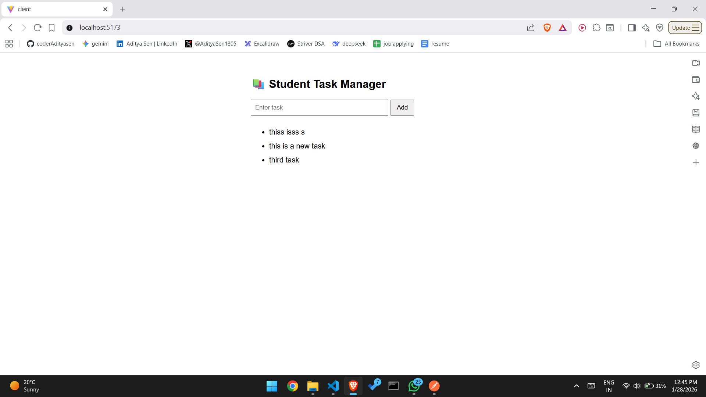

# Student Task Manager - Web Development Project

## Project Overview
A Single Page Application (SPA) built with React (frontend) and Express.js (backend) to manage and track homework tasks efficiently.

## How I Thought
I approached this project by:
1. **Separating concerns** - Backend API handles data logic, frontend manages UI/UX
2. **Real-time updates** - React state management for instant task list updates without page refresh
3. **Persistent storage** - JSON to preserve tasks.
4. **Simple UX** - Minimal interface with input field and "Add" button for quick task entry

## Challenges Faced
- **CORS configuration** - Resolved cross-origin requests between React dev server and Express API
- **State synchronization** - Ensured frontend state stays in sync with backend data
- **Database setup** - Configured JSON file handling for reliable task persistence
- **No page refresh requirement** - Implemented fetch API with proper async/await patterns

## Tech Stack
- **Frontend:** React, JavaScript, HTML/CSS
- **Backend:** Express.js, Node.js
- **Database:** JSON file storage

## Features
✅ Add new tasks via input field  
✅ Display task list dynamically  
✅ Persistent storage (local database)  
✅ Single Page Application (no refresh)  
✅ Clean, commented source code  

## Screenshots

### 1. POST Request - Add task

### 1. GET Request - Get tasks

