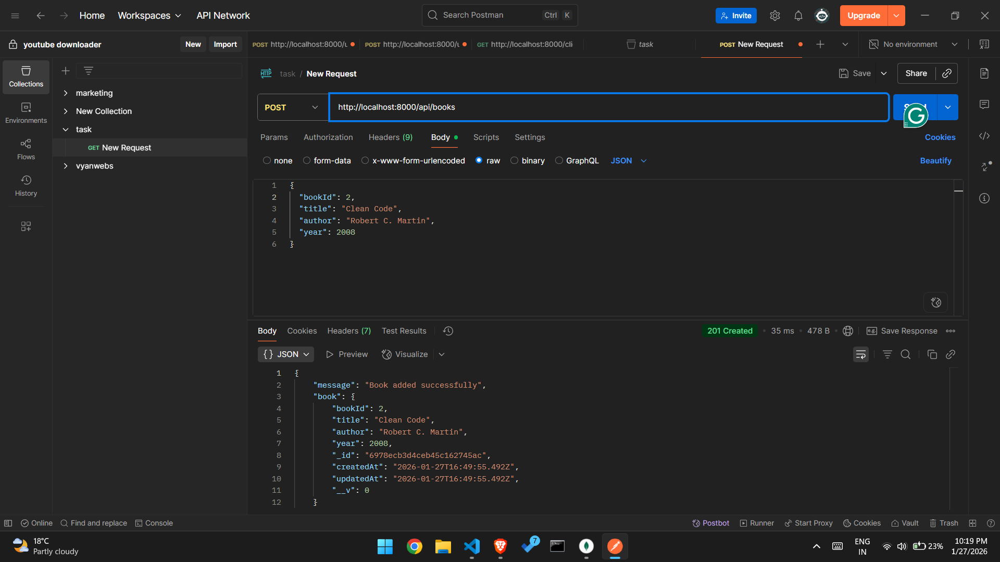
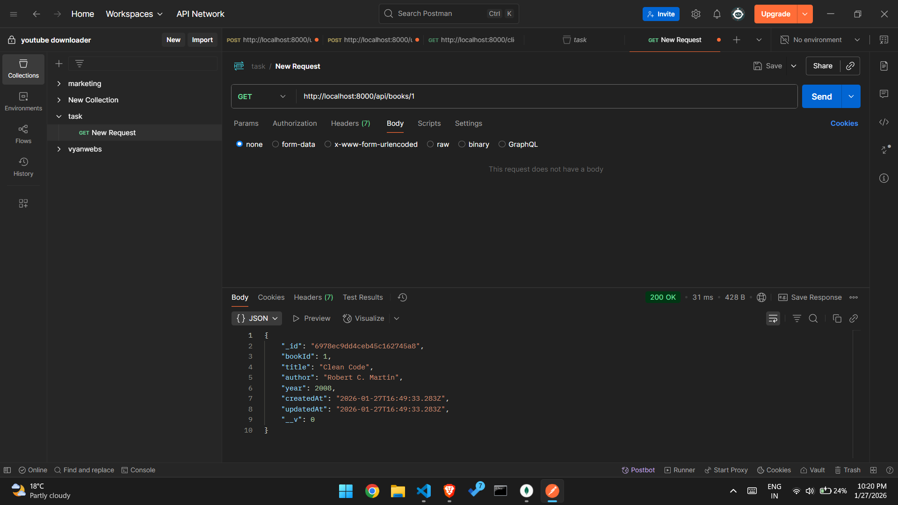

# In-Memory Library API

## Overview

A production-grade REST API for managing a library book inventory built with Node.js, Express, and MongoDB.

## Tech Stack

- **Runtime**: Node.js
- **Framework**: Express.js
- **Database**: MongoDB (with Mongoose ODM)
- **Development**: Nodemon

## Installation

```bash
npm install express nodemon mongoose
npm start
```

## API Endpoints

| Method | Endpoint                  | Description          |
| ------ | ------------------------- | -------------------- |
| POST   | `/books`                  | Add a new book       |
| GET    | `/books/{id}`             | Retrieve book by ID  |
| GET    | `/books/search?year=2024` | Filter books by year |
| DELETE | `/books/{id}`             | Delete a book        |

## Project Structure

```
├── models/book.models.js          # Database schemas
├── controllers/book.controller.js # Business logic
├── routes/book.routes.js          # API endpoints
├── server.js                      # Main entry point
└── photos/                        # Screenshots
```

## How I Thought

Structured the application following production best practices with separation of concerns: Models handle data schemas, Controllers manage business logic, and Routes define API endpoints.

## Challenges Faced

- Setting up MongoDB connection with Mongoose
- Validating request data across different endpoints
- Implementing proper error handling in async operations

## Screenshots

### 1. POST Request - Add Book



### 2. GET Request - Retrieve Book



### 3. GET Request - Filter by Year


### 4. DELETE Request - Remove Book


